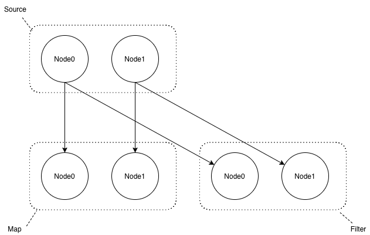
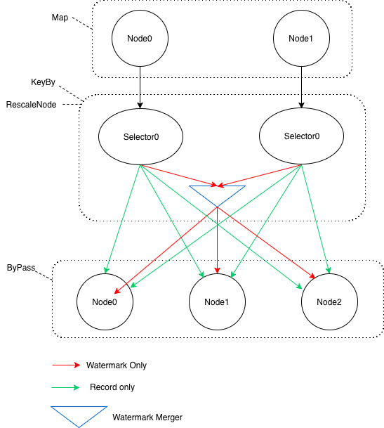

Execution Nodes
==========

[TOC]

# Summary

This doc is about execution nodes. kinds of execution nodes and topology of them and how operator work.

# Execution Node

Two kind of node are BroadcastNode and RescaleNode.

## BroadcastNode

BraodcastNode is one to many node, used in most non-rescaling operator and source operator (for now).

## RescaleNode

RescaleNode is many to many node, used in rescaling operator (exp: KeyBy)

